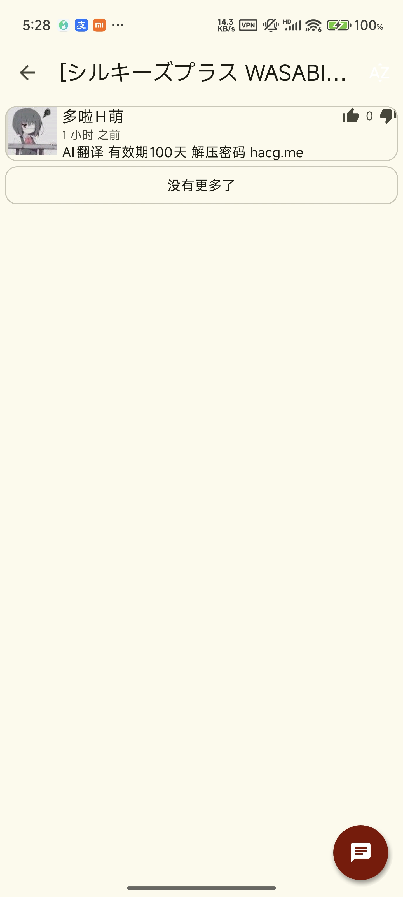

## Hacg
#### An acg reader for Android application.
I fork it and add some material you feature. 

The Version will be same with upsteam.

#### publish: https://github.com/shizheng233/hacg/releases

#### screenshot

  

